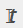

= Gérer les sauvegardes
:allow-uri-read: 
:icons: font
:imagesdir: ../media/

[role="lead"]
Vous pouvez renommer et supprimer des sauvegardes. Vous pouvez également supprimer plusieurs sauvegardes simultanément.

== Renommer les sauvegardes

Vous pouvez renommer les sauvegardes si vous voulez fournir un meilleur nom pour améliorer la capacité de recherche.

*Étapes*

. Dans le volet de navigation de gauche, cliquez sur *Ressources*, puis sélectionnez le plug-in approprié dans la liste.
. Dans la page Ressources, sélectionnez la ressource ou le groupe de ressources dans la liste déroulante *Affichage*.
. Sélectionnez la ressource ou le groupe de ressources dans la liste.
+
La page topologie des ressources ou des groupes de ressources s'affiche. Si la ressource ou le groupe de ressources n'est pas configuré pour la protection des données, l'assistant de protection s'affiche à la place de la page de topologie.

. Dans la vue gérer les copies, sélectionnez *sauvegardes* dans les systèmes de stockage principaux.
+
Vous ne pouvez pas renommer les sauvegardes qui se trouvent sur le système de stockage secondaire.

+
Si vous avez catalogué les sauvegardes des bases de données Oracle à l'aide d'Oracle Recovery Manager (RMAN), vous ne pouvez pas renommer ces sauvegardes cataloguées.

. Sélectionnez la sauvegarde, puis cliquez sur .
. Dans le champ *Renommer la sauvegarde sous*, saisissez un nouveau nom et cliquez sur *OK*.

== Supprimer les sauvegardes

Vous pouvez supprimer des sauvegardes si vous n'avez plus besoin de sauvegarder pour d'autres opérations de protection des données.

.Avant de commencer
Vous devez avoir supprimé les clones associés avant de supprimer une sauvegarde.

NOTE: Si une sauvegarde est associée à une ressource clonée, vous ne pouvez pas la supprimer.

*Étapes*

. Dans le volet de navigation de gauche, cliquez sur *Ressources*, puis sélectionnez le plug-in approprié dans la liste.
. Dans la page Ressources, sélectionnez la ressource ou le groupe de ressources dans la liste déroulante *Affichage*.
. Sélectionnez la ressource ou le groupe de ressources dans la liste.
+
La page topologie des ressources ou des groupes de ressources s'affiche.

. Dans la vue gérer les copies, sélectionnez *sauvegardes* dans les systèmes de stockage principaux.
+
Vous ne pouvez pas supprimer les sauvegardes qui se trouvent sur le système de stockage secondaire.

. Sélectionnez la sauvegarde, puis cliquez sur image:../media/delete_icon.gif["icône supprimer"].
+
Si vous supprimez une sauvegarde de base de données SAP HANA, les catalogues SAP HANA associés de la sauvegarde sont également supprimés.

+

NOTE: Si la dernière sauvegarde restante est supprimée, les entrées du catalogue HANA associées ne peuvent pas être supprimées.

. Cliquez sur *OK*.
+

NOTE: Si certaines sauvegardes de base de données obsolètes se trouvent dans SnapCenter qui ne disposent pas des sauvegardes correspondantes sur le système de stockage, vous devez utiliser la commande remove-smbackup pour nettoyer ces entrées de sauvegarde obsolètes. Si les sauvegardes obsolètes ont été cataloguées, elles seront décataloguées à partir de la base de données du catalogue de reprise.

== Déposer la protection

Supprimer la protection supprime toutes les sauvegardes et détache toutes les règles. Avant de supprimer la protection, assurez-vous que les sauvegardes ne sont pas montées et qu'aucun clone n'est associé à la sauvegarde.

*Étapes*

. Dans le volet de navigation de gauche, cliquez sur *Ressources*, puis sélectionnez le plug-in approprié dans la liste.
. Dans la page Ressources, sélectionnez la ressource ou le groupe de ressources dans la liste déroulante *Affichage*.
. Sélectionnez la ressource ou le groupe de ressources dans la liste.
+
La page topologie des ressources ou des groupes de ressources s'affiche.

. Sélectionnez la sauvegarde et cliquez sur *Supprimer la protection*.

