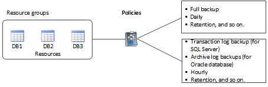

= Ressources, groupes de ressources et politiques
:allow-uri-read: 
:icons: font
:imagesdir: ../media/

[role="lead"]
Avant d'utiliser SnapCenter, il est utile de maîtriser les concepts de base associés aux opérations de sauvegarde, de clonage et de restauration que vous souhaitez effectuer. Vous interagissez avec les ressources, les groupes de ressources et les stratégies pour différentes opérations.

* *Les ressources* sont généralement des bases de données, des systèmes de fichiers Windows ou des partages de fichiers que vous sauvegardez ou clonez avec SnapCenter.
+
Toutefois, selon votre environnement, les ressources peuvent être des instances de base de données, des groupes de disponibilité Microsoft SQL Server, des bases de données Oracle RAC, des systèmes de fichiers Windows ou un groupe d'applications personnalisées.

* Un *groupe de ressources* est un ensemble de ressources sur un hôte ou un cluster. Le groupe de ressources peut également contenir des ressources provenant de plusieurs hôtes et de plusieurs clusters.
+
Lorsque vous effectuez une opération sur un groupe de ressources, vous effectuez cette opération sur toutes les ressources définies dans le groupe de ressources en fonction du planning que vous spécifiez pour le groupe de ressources.

+
Vous pouvez sauvegarder à la demande une seule ressource ou un groupe de ressources. Vous pouvez également configurer des sauvegardes planifiées pour des ressources et des groupes de ressources uniques.

+

NOTE: Si vous mettez un hôte d'un groupe de ressources partagé en mode maintenance et si des planifications sont associées au même groupe de ressources partagées, toutes les opérations planifiées seront suspendues pour tous les autres hôtes du groupe de ressources partagées.

+
Vous devez utiliser un plug-in de base de données pour sauvegarder des bases de données, un plug-in de système de fichiers pour sauvegarder des systèmes de fichiers et le plug-in SnapCenter pour VMware vSphere pour sauvegarder des machines virtuelles et des datastores.

* *Stratégies* spécifier la fréquence de sauvegarde, la conservation des copies, la réplication, les scripts et d'autres caractéristiques des opérations de protection des données.
+
Lorsque vous créez un groupe de ressources, vous sélectionnez une ou plusieurs stratégies pour ce groupe. Vous pouvez également sélectionner une stratégie lorsque vous effectuez une sauvegarde à la demande.

Pensez à un groupe de ressources comme définissant _quoi_ vous voulez protéger et quand vous voulez le protéger en termes de jour et de temps. Pensez à une stratégie comme définir _comment_ vous voulez la protéger. Si vous sauvegardez toutes les bases de données ou que vous sauvegardez tous les systèmes de fichiers d'un hôte, par exemple, vous pouvez créer un groupe de ressources qui inclut toutes les bases de données ou tous les systèmes de fichiers de l'hôte. Vous pouvez ensuite associer deux stratégies au groupe de ressources : une stratégie quotidienne et une stratégie horaire.

Lorsque vous créez le groupe de ressources et joignez les stratégies, vous pouvez configurer le groupe de ressources pour effectuer une sauvegarde complète tous les jours et un autre programme qui effectue des sauvegardes de journaux toutes les heures.

L'image suivante illustre la relation entre les ressources, les groupes de ressources et les politiques des bases de données :

L'image suivante illustre la relation entre les ressources, les groupes de ressources et les stratégies des systèmes de fichiers Windows :

image::../media/resources_and_policies_for_wfs.gif[ressources et politiques pour wfs]
