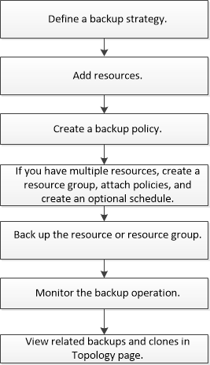

= Sauvegarder des ressources de plug-in personnalisées
:allow-uri-read: 
:icons: font
:imagesdir: ../media/

[role="lead"]
Le workflow de sauvegarde comprend la planification, l'identification des ressources de sauvegarde, la gestion des stratégies de sauvegarde, la création de groupes de ressources et la connexion de stratégies, la création de sauvegardes et le contrôle des opérations.

Le workflow suivant montre la séquence dans laquelle vous devez effectuer l'opération de sauvegarde :

Vous pouvez également utiliser les applets de commande PowerShell manuellement ou dans des scripts pour réaliser des opérations de sauvegarde, de restauration et de clonage. Pour plus d'informations sur les applets de commande PowerShell, utilisez l'aide de la cmdlet SnapCenter ou reportez-vous à la https://library.netapp.com/ecm/ecm_download_file/ECMLP2883300["Guide de référence de l'applet de commande du logiciel SnapCenter"]
