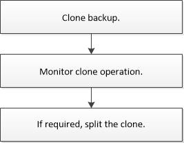

= Workflow de clonage
:allow-uri-read: 
:icons: font
:imagesdir: ../media/

[role="lead"]
Le workflow de clonage inclut la planification, la réalisation de l'opération de clonage et le contrôle de l'opération.

Il est possible de cloner des bases de données pour les raisons suivantes :

* Tester les fonctionnalités à implémenter à l'aide de la structure et du contenu actuels de la base de données au cours des cycles de développement d'applications.
* Pour renseigner les data warehouses à l'aide d'outils d'extraction et de manipulation de données.
* Pour récupérer les données qui ont été supprimées ou modifiées par erreur.

Le workflow suivant affiche la séquence dans laquelle vous devez effectuer l'opération de clonage :

