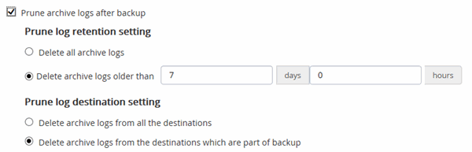

= Créez des règles de sauvegarde pour les bases de données Oracle
:allow-uri-read: 
:icons: font
:imagesdir: ../media/

[role="lead"]
Avant d'utiliser SnapCenter pour sauvegarder les ressources de la base de données Oracle, vous devez créer une stratégie de sauvegarde pour la ressource ou le groupe de ressources à sauvegarder. Une stratégie de sauvegarde est un ensemble de règles qui régit la gestion, la planification et la conservation des sauvegardes. Vous pouvez également spécifier les paramètres de réplication, de script et de type de sauvegarde. La création d'une stratégie permet de gagner du temps lorsque vous souhaitez réutiliser la stratégie sur une autre ressource ou un autre groupe de ressources.

*Ce dont vous aurez besoin*

* Vous devez avoir défini votre stratégie de sauvegarde.
* Vous devez être prêt pour la protection des données en exécutant des tâches telles que l'installation d'SnapCenter, l'ajout d'hôtes, la détection de bases de données et la création de connexions du système de stockage.
* Si vous répliquez des copies Snapshot sur un stockage secondaire miroir ou vault, l'administrateur SnapCenter doit avoir attribué les SVM à vous pour les volumes source et de destination.

*Étapes*

. Dans le volet de navigation de gauche, cliquez sur *Paramètres*.
. Dans la page Paramètres, cliquez sur *stratégies*.
. Sélectionnez *Oracle Database* dans la liste déroulante.
. Cliquez sur *Nouveau*.
. Dans la page Nom, entrez le nom et la description de la stratégie.
. Dans la page Type de sauvegarde, effectuez les opérations suivantes :
+
** Si vous souhaitez *créer une sauvegarde en ligne*, sélectionnez *sauvegarde en ligne*.
+
Vous devez indiquer si vous souhaitez sauvegarder tous les fichiers de données, les fichiers de contrôle et les fichiers journaux d'archivage, uniquement les fichiers de données et les fichiers de contrôle, ou uniquement les fichiers journaux d'archivage.

** Si vous souhaitez *créer une sauvegarde hors ligne*, sélectionnez *sauvegarde hors ligne*, puis sélectionnez l'une des options suivantes :
+
*** Si vous souhaitez créer une sauvegarde hors ligne lorsque la base de données est à l'état monté, sélectionnez *Mount*.
*** Si vous souhaitez créer une sauvegarde d'arrêt hors ligne en changeant l'état d'arrêt de la base de données, sélectionnez *Shutdown*.
+
Si vous disposez de bases de données enfichables (PDB) et que vous souhaitez enregistrer l'état des PDB avant de créer la sauvegarde, vous devez sélectionner *Enregistrer l'état des PDB*. Cela vous permet de ramener les PDB à leur état d'origine une fois la sauvegarde créée.

** Spécifiez la fréquence d'horaire en sélectionnant *sur demande*, *horaire*, *quotidien*, *hebdomadaire* ou *mensuel*.
+

NOTE: Vous pouvez spécifier le planning (date de début et date de fin) de l'opération de sauvegarde lors de la création d'un groupe de ressources. Cela vous permet de créer des groupes de ressources partageant la même stratégie et la même fréquence de sauvegarde, mais vous permet d'affecter des programmes de sauvegarde différents à chaque stratégie.

+

NOTE: Si vous avez prévu 2 h 00, l'horaire ne sera pas déclenché pendant l'heure d'été (DST).

** Si vous souhaitez cataloguer la sauvegarde à l'aide d'Oracle Recovery Manager (RMAN), sélectionnez *sauvegarde de catalogue avec Oracle Recovery Manager (RMAN)*.
+
Vous pouvez effectuer le catalogage différé d'une sauvegarde à la fois à l'aide de l'interface utilisateur graphique ou à l'aide de la commande SnapCenter CLI Catalog-SmBackupWithOracleRMAN.

+

NOTE: Si vous souhaitez cataloguer les sauvegardes d'une base de données RAC, assurez-vous qu'aucune autre tâche n'est en cours d'exécution pour cette base de données. Si un autre travail est en cours d'exécution, l'opération de catalogage échoue au lieu d'être mise en file d'attente.

** Si vous souhaitez élaguer les journaux d'archive après la sauvegarde, sélectionnez *Prune archive logs après la sauvegarde*.
+

NOTE: L'élagage des journaux d'archive de la destination du journal d'archivage qui n'est pas configurée dans la base de données sera ignoré.

+

IMPORTANT: Si vous utilisez Oracle Standard Edition, vous pouvez utiliser LES paramètres LOG_ARCHIVE_DEST et LOG_ARCHIVE_DUPLEX_DEST lors de la sauvegarde du journal d'archivage.

** Vous ne pouvez supprimer les journaux d'archive que si vous avez sélectionné les fichiers journaux d'archive dans le cadre de votre sauvegarde.
+

NOTE: Vous devez vous assurer que tous les nœuds d'un environnement RAC peuvent accéder à tous les emplacements du journal d'archivage pour que l'opération de suppression soit réussie.

+
|===
| Les fonctions que vous recherchez... | Alors... 

 a| 
Supprimer tous les journaux d'archive
 a| 
Sélectionnez *Supprimer tous les journaux d'archive*.

 a| 
Supprimer les journaux d'archive plus anciens
 a| 
Sélectionnez *Supprimer les journaux d'archive plus anciens que*, puis spécifiez l'âge des journaux d'archive à supprimer en jours et en heures.

 a| 
Supprimer les journaux d'archive de toutes les destinations
 a| 
Sélectionnez *Supprimer les journaux d'archive de toutes les destinations*.

 a| 
Supprimez les journaux d'archivage des destinations de journaux qui font partie de la sauvegarde
 a| 
Sélectionnez *Supprimer les journaux d'archive des destinations qui font partie de la sauvegarde*.

|===
+

. Dans la page Retention, spécifiez les paramètres de conservation pour le type de sauvegarde et le type de programme sélectionné dans la page Type de sauvegarde :
+
|===

| Les fonctions que vous recherchez... | Alors... 

 a| 
Conserver un certain nombre de copies Snapshot
 a| 
Sélectionnez *nombre total de copies Snapshot à conserver*, puis spécifiez le nombre de copies Snapshot que vous souhaitez conserver.

Si le nombre de copies Snapshot dépasse le nombre spécifié, les copies Snapshot sont supprimées par les plus anciennes copies supprimées en premier.

NOTE: La valeur maximale de rétention est de 1018 pour les ressources sur ONTAP 9.4 ou version ultérieure et de 254 pour les ressources sur ONTAP 9.3 ou version antérieure. Les sauvegardes échouent si la conservation est définie sur une valeur supérieure à celle prise en charge par la version ONTAP sous-jacente.

IMPORTANT: Si vous prévoyez d'activer la réplication SnapVault, vous devez définir le nombre de rétention sur 2 ou plus. Si vous définissez le nombre de rétention sur 1, l'opération de conservation peut échouer, car la première copie Snapshot est la copie de référence pour la relation SnapVault jusqu'à ce qu'une nouvelle copie Snapshot soit répliquée vers la cible.

 a| 
Conservez les copies Snapshot pendant un certain nombre de jours
 a| 
Sélectionnez *conserver les copies Snapshot pour*, puis indiquez le nombre de jours pendant lesquels vous souhaitez conserver les copies Snapshot avant de les supprimer.

|===
+

NOTE: Vous ne pouvez conserver les sauvegardes du journal d'archivage que si vous avez sélectionné les fichiers journaux d'archive dans le cadre de votre sauvegarde.

. Dans la page réplication, spécifiez les paramètres de réplication :
+
|===
| Pour ce champ... | Procédez comme ça... 

 a| 
Mettez à jour SnapMirror après avoir créé une copie Snapshot locale
 a| 
Sélectionnez ce champ pour créer des copies en miroir des jeux de sauvegarde sur un autre volume (réplication SnapMirror).

 a| 
Mettez à jour SnapVault après avoir créé une copie Snapshot locale
 a| 
Sélectionnez cette option pour effectuer la réplication de sauvegarde disque à disque (sauvegardes SnapVault).

 a| 
Deuxième étiquette de police
 a| 
Sélectionnez une étiquette Snapshot.

En fonction de l'étiquette de copie Snapshot que vous sélectionnez, ONTAP applique la règle de conservation des copies Snapshot secondaires correspondant à l'étiquette.

NOTE: Si vous avez sélectionné *mettre à jour SnapMirror après la création d'une copie Snapshot locale*, vous pouvez éventuellement spécifier l'étiquette de règle secondaire. Toutefois, si vous avez sélectionné *mettre à jour SnapVault après la création d'une copie Snapshot locale*, vous devez spécifier l'étiquette de la stratégie secondaire.

 a| 
Nombre de tentatives d'erreur
 a| 
Saisissez le nombre maximal de tentatives de réplication pouvant être autorisées avant l'arrêt de l'opération.

|===
+

NOTE: Il est recommandé de configurer la règle de conservation SnapMirror dans ONTAP pour le stockage secondaire afin d'éviter la limite maximale des copies Snapshot sur le stockage secondaire.

. Dans la page script, entrez le chemin d'accès et les arguments du prescripteur ou du PostScript que vous souhaitez exécuter avant ou après l'opération de sauvegarde, respectivement.
+
Vous devez stocker les scripts prescripteurs et postscripts dans _/var/opt/snapcenter/spl/scripts_ ou dans n'importe quel dossier de ce chemin d'accès. Par défaut, le chemin _/var/opt/snapcenter/spl/scripts_ est renseigné. Si vous avez créé des dossiers dans ce chemin pour stocker les scripts, vous devez spécifier ces dossiers dans le chemin d'accès.

+
Vous pouvez également spécifier la valeur du délai d'expiration du script. La valeur par défaut est 60 secondes.

+
SnapCenter vous permet d'utiliser les variables d'environnement prédéfinies lorsque vous exécutez le prescripteur et le PostScript. link:../protect-sco/predefined-environment-variables-prescript-postscript-backup.html["En savoir plus >>"^]

. Dans la page Vérification, effectuez les opérations suivantes :
+
.. Sélectionnez le planning de sauvegarde pour lequel vous souhaitez effectuer l'opération de vérification.
.. Dans la section commandes du script de vérification, entrez le chemin et les arguments du prescripteur ou du PostScript que vous souhaitez exécuter avant ou après l'opération de vérification, respectivement.
+
Vous devez stocker les scripts prescripteurs et postscripts dans _/var/opt/snapcenter/spl/scripts_ ou dans n'importe quel dossier de ce chemin d'accès. Par défaut, le chemin _/var/opt/snapcenter/spl/scripts_ est renseigné. Si vous avez créé des dossiers dans ce chemin pour stocker les scripts, vous devez spécifier ces dossiers dans le chemin d'accès.

+
Vous pouvez également spécifier la valeur du délai d'expiration du script. La valeur par défaut est 60 secondes.

. Vérifiez le résumé, puis cliquez sur *Terminer*.

