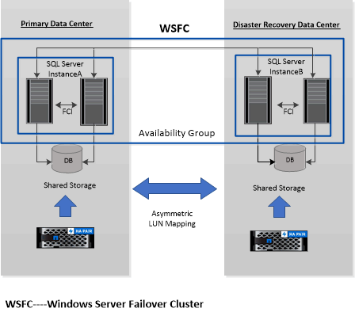

= Prise en charge du mappage des LUN asymétriques dans les clusters Windows
:allow-uri-read: 
:icons: font
:imagesdir: ../media/

[role="lead"]
Le plug-in SnapCenter pour Microsoft SQL Server prend en charge la détection dans SQL Server 2012 et versions ultérieures, les configurations ALM (Asymmetric LUN Mapping) pour la haute disponibilité, et les groupes de disponibilité pour la reprise après incident. Lors de la découverte des ressources, SnapCenter détecte les bases de données sur les hôtes locaux et sur les hôtes distants dans les configurations ALM.

Une configuration ALM est un cluster de basculement de serveur Windows unique qui contient un ou plusieurs nœuds dans un centre de données principal et un ou plusieurs nœuds dans un centre de reprise après incident.

Voici un exemple de configuration ALM :

* Deux instances de cluster de basculement (FCI) dans un data Center multisite
* FCI pour la haute disponibilité locale (HA) et le groupe de disponibilité (AG) pour la reprise après incident avec une instance autonome sur le site de reprise après incident

Le stockage du data Center principal est partagé entre les nœuds FCI présents dans le data Center principal. Le stockage du centre de données de reprise après incident est partagé entre les nœuds FCI présents dans le centre de données de reprise après incident.

Le stockage du data Center principal n'est pas visible sur les nœuds du centre de reprise après incident, et inversement.

L'architecture ALM combine deux solutions de stockage partagé utilisées par FCI, avec une solution de stockage non partagée ou dédiée utilisée par SQL AG. La solution AG utilise des lettres de lecteur identiques pour les ressources de disque partagées sur l'ensemble des centres de données. Cet arrangement de stockage, où un disque de cluster est partagé entre un sous-ensemble de nœuds dans un WSFC, est appelé ALM.
