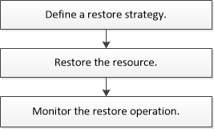

= Restaurer le flux de travail
:allow-uri-read: 
:icons: font
:imagesdir: ../media/

[role="lead"]
Vous pouvez utiliser SnapCenter pour restaurer les bases de données SQL Server en les restaurant depuis une ou plusieurs sauvegardes vers votre système de fichiers actif, puis en récupérant la base de données. Vous pouvez également restaurer les bases de données qui se trouvent dans les groupes de disponibilité, puis ajouter les bases de données restaurées au groupe de disponibilité. Avant de restaurer une base de données SQL Server, vous devez effectuer plusieurs tâches préparatoires.

Le workflow suivant montre la séquence dans laquelle vous devez effectuer les opérations de restauration de la base de données :

Vous pouvez également utiliser les applets de commande PowerShell manuellement ou dans des scripts pour réaliser des opérations de sauvegarde, de restauration, de restauration, de vérification et de clonage. Pour plus d'informations sur les applets de commande PowerShell, utilisez l'aide de la cmdlet SnapCenter ou reportez-vous à la https://library.netapp.com/ecm/ecm_download_file/ECMLP2874310["Guide de référence de l'applet de commande du logiciel SnapCenter 4.4"]

*Plus d'informations*

link:task_restore_a_sql_server_database_from_secondary_storage.html["Restaurer une base de données SQL Server à partir du stockage secondaire"]

link:task_restore_and_recover_resources_using_powershell_cmdlets_for_sql.html["Restauration et restauration des ressources via les applets de commande PowerShell"]

link:https://kb.netapp.com/Advice_and_Troubleshooting/Data_Protection_and_Security/SnapCenter/Restore_operation_might_fail_on_Windows_2008_R2["La restauration peut échouer sur Windows 2008 R2"]
