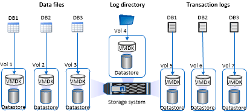

= Recommandations relatives à l'organisation du stockage pour le plug-in SnapCenter pour Microsoft SQL Server
:allow-uri-read: 
:icons: font
:imagesdir: ../media/

[role="lead"]
Grâce à une disposition de stockage bien conçue, SnapCenter Server peut sauvegarder vos bases de données pour atteindre vos objectifs de restauration. Vous devez tenir compte de plusieurs facteurs lors de la définition de l'organisation du stockage, notamment la taille de la base de données, le taux de changement de la base de données et la fréquence à laquelle vous effectuez des sauvegardes.

Les sections suivantes définissent les recommandations et restrictions relatives à l'infrastructure de stockage pour les LUN et les disques des machines virtuelles (VMDK) avec le plug-in SnapCenter pour Microsoft SQL Server installé dans votre environnement.

Dans ce cas, les LUN peuvent inclure des disques VMware RDM et des LUN iSCSI à connexion directe mappés à l'invité.

== Exigences relatives aux LUN et aux VMDK

Vous pouvez choisir d'utiliser des LUN ou des VMDK dédiés pour optimiser les performances et la gestion des bases de données suivantes :

* Bases de données du système maître et modèle
* Tempdb
* Fichiers de base de données utilisateur (.mdf et .ndf)
* Fichiers du journal de transactions de la base de données utilisateur (.ldf)
* Répertoire du journal

Pour restaurer des bases de données volumineuses, il est recommandé d'utiliser des LUN ou des VMDK dédiés. Le temps nécessaire à la restauration d'une LUN ou d'un VMDK complet est inférieur au temps requis pour restaurer les fichiers individuels stockés dans le LUN ou le VMDK.

Pour le répertoire du journal, vous devez créer une LUN ou un VMDK distinct de sorte que l'espace disponible dans les disques de données ou de fichiers journaux soit suffisant.

== Exemples de dispositions des LUN et VMDK

Le graphique suivant explique comment configurer l'organisation du stockage pour les bases de données volumineuses sur les LUN :

image::../media/smsql_storage_layout_mult_vols_snapcenter.gif[Diagramme de LUN multiples]

Le graphique suivant explique comment configurer l'organisation du stockage pour les bases de données de taille moyenne ou petite taille sur les LUN :

image::../media/smsql_storage_layout_mult_dbs_luns_snapcenter.gif[Plusieurs bases de données par LUN]

Le graphique suivant montre comment configurer l'organisation du stockage pour les grandes bases de données sur des VMDK :

Le graphique suivant montre comment configurer l'organisation du stockage pour des bases de données de taille moyenne ou petite taille sur des VMDK :

image::../media/smsql_storage_layout_med_small_dbs_vmdk.gif[Disposition du stockage pour les bases de données de taille moyenne ou réduite sur les VMDK]
