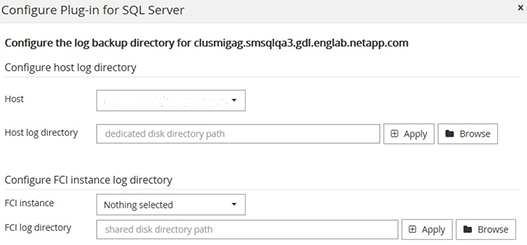

= Ajoutez des hôtes et installez le package de plug-ins SnapCenter pour Windows
:allow-uri-read: 
:icons: font
:imagesdir: ../media/

[role="lead"]
Vous devez utiliser la page SnapCenter *Ajouter hôte* pour ajouter des hôtes et installer le module de plug-ins. Les plug-ins sont automatiquement installés sur les hôtes distants.

*Ce dont vous aurez besoin*

* Vous devez être un utilisateur affecté à un rôle disposant des autorisations d'installation et de désinstallation du plug-in, comme le rôle d'administrateur SnapCenter.
* Lors de l'installation d'un plug-in sur un hôte Windows, si vous spécifiez un identifiant qui n'est pas intégré, vous devez désactiver l'UAC sur l'hôte.
* Vous devez vous assurer que le service de mise en file d'attente des messages est en cours d'exécution.
* Si vous utilisez le compte de service géré de groupe (GMSA), vous devez configurer GMSA avec des privilèges d'administration.
+
link:task_configure_gMSA_on_windows_server_2012_or_later.html["Configurez le compte de service géré par groupe sous Windows Server 2012 ou version ultérieure pour SQL"^]

*À propos de cette tâche*

Vous ne pouvez pas ajouter un serveur SnapCenter en tant qu'hôte de plug-in à un autre serveur SnapCenter.

Vous pouvez ajouter un hôte et installer les modules d'extension pour un hôte individuel ou pour un cluster. Si vous installez les plug-ins sur un cluster ou Windows Server Failover Clustering (WSFC), les plug-ins sont installés sur tous les nœuds du cluster.

Pour plus d'informations sur la gestion des hôtes, reportez-vous à la section link:../admin/concept_manage_hosts.html["Gérer les hôtes"^].

*Étapes*

. Dans le volet de navigation de gauche, cliquez sur *hosts*.
. Vérifiez que l'onglet *Managed Hosts* est sélectionné en haut.
. Cliquez sur *Ajouter*.
. Dans la page hôtes, procédez comme suit :
+
|===
| Pour ce champ... | Procédez comme ça... 

 a| 
Type d'hôte
 a| 
Sélectionnez Windows comme type d'hôte. Le serveur SnapCenter ajoute l'hôte, puis installe le plug-in pour Windows si le plug-in n'est pas déjà installé sur l'hôte.

Si vous sélectionnez l'option Microsoft SQL Server sur la page Plug-ins, le serveur SnapCenter installe le plug-in pour SQL Server.

 a| 
Nom d'hôte
 a| 
Saisissez le nom de domaine complet (FQDN) ou l'adresse IP de l'hôte. L'adresse IP n'est prise en charge pour les hôtes de domaine non approuvés que si elle résout le FQDN.

SnapCenter dépend de la configuration appropriée du DNS. Par conséquent, la meilleure pratique consiste à saisir le FQDN.

Vous pouvez entrer les adresses IP ou FQDN de l'un des éléments suivants :

** Hôte autonome
** WSFC si vous ajoutez un hôte à l'aide de SnapCenter et que l'hôte fait partie d'un sous-domaine, vous devez fournir le FQDN.

 a| 
Informations d'identification
 a| 
Sélectionnez le nom d'identification que vous avez créé ou créez de nouvelles informations d'identification. Les informations d'identification doivent disposer de droits d'administration sur l'hôte distant. Pour plus de détails, reportez-vous aux informations sur la création des informations d'identification.

Vous pouvez afficher des détails sur les informations d'identification en positionnant le curseur sur le nom d'identification que vous avez spécifié.

NOTE: Le mode d'authentification des informations d'identification est déterminé par le type d'hôte que vous spécifiez dans l'assistant Ajout d'hôte.

|===
. Dans la section *Select Plug-ins to Install*, sélectionnez les plug-ins à installer.
. Cliquez sur *plus d'options*.
+
|===
| Pour ce champ... | Procédez comme ça... 

 a| 
Port
 a| 
Conservez le numéro de port par défaut ou spécifiez le numéro de port. Le numéro de port par défaut est 8145. Si le serveur SnapCenter a été installé sur un port personnalisé, ce numéro de port est affiché comme port par défaut.

NOTE: Si vous avez installé manuellement les plug-ins et spécifié un port personnalisé, vous devez spécifier le même port. Dans le cas contraire, l'opération échoue.

 a| 
Chemin d'installation
 a| 
Le chemin par défaut est C:\Program Files\NetApp\SnapCenter. Vous pouvez éventuellement personnaliser le chemin.

 a| 
Ajoutez tous les hôtes du cluster
 a| 
Cochez cette case pour ajouter tous les nœuds du cluster dans un WSFC ou un groupe de disponibilité SQL. Vous devez ajouter tous les nœuds du cluster en cochant la case de cluster appropriée dans l'interface graphique si vous souhaitez gérer et identifier plusieurs groupes de disponibilité SQL disponibles dans un cluster.

 a| 
Ignorer les vérifications de préinstallation
 a| 
Cochez cette case si vous avez déjà installé les plug-ins manuellement et que vous ne souhaitez pas vérifier si l'hôte répond aux exigences d'installation du plug-in.

 a| 
Utilisez le compte de service géré de groupe (GMSA) pour exécuter les services du plug-in
 a| 
Cochez cette case si vous souhaitez utiliser le compte de service géré de groupe (GMSA) pour exécuter les services du plug-in.

Indiquez le nom GMSA au format suivant : domainname\accountName$.

NOTE: Si l'hôte est ajouté avec GMSA et si le GMSA dispose de privilèges d'ouverture de session et d'administrateur système, le GMSA sera utilisé pour se connecter à l'instance SQL.

|===
. Cliquez sur *soumettre*.
. Pour le plug-in SQL, sélectionnez l'hôte pour configurer le répertoire du journal.
+
.. Cliquez sur *configurer le répertoire du journal* et, dans la page configurer le répertoire du journal hôte, cliquez sur *Parcourir* et procédez comme suit :
+
Seules les LUN NetApp (disques) sont répertoriées pour être sélectionnées. SnapCenter sauvegarde et réplique le répertoire journal de l'hôte dans le cadre de l'opération de sauvegarde.

+

+
... Sélectionnez la lettre de lecteur ou le point de montage sur l'hôte sur lequel le journal hôte sera stocké.
... Choisissez un sous-répertoire, le cas échéant.
... Cliquez sur *Enregistrer*.

. Cliquez sur *soumettre*.
+
Si vous n'avez pas coché la case *Skip précontrôles*, l'hôte est validé pour vérifier s'il répond aux exigences d'installation du plug-in. L'espace disque, la RAM, la version PowerShell, la version .NET, l'emplacement (pour les plug-ins Windows) et la version Java (pour les plug-ins Linux) sont validés par rapport à la configuration minimale requise. Si la configuration minimale requise n'est pas respectée, des messages d'erreur ou d'avertissement appropriés s'affichent.

+
Si l'erreur est liée à l'espace disque ou à la RAM, vous pouvez mettre à jour le fichier web.config situé à l'adresse C:\Program Files\NetApp\SnapCenter WebApp pour modifier les valeurs par défaut. Si l'erreur est liée à d'autres paramètres, vous devez corriger le problème.

+

NOTE: Dans une configuration HA, si vous mettez à jour le fichier web.config, vous devez le mettre à jour sur les deux nœuds.

. Surveillez la progression de l'installation.

