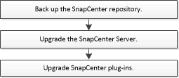

= Mise à niveau du workflow
:allow-uri-read: 
:icons: font
:imagesdir: ../media/

[role="lead"]
Chaque version de SnapCenter contient un serveur SnapCenter et un pack de plug-in mis à jour. Les mises à jour des modules d'extension sont distribuées avec le programme d'installation de SnapCenter. Vous pouvez configurer SnapCenter pour vérifier les mises à jour disponibles.

Le flux de travail répertorie les tâches que vous devez effectuer pour mettre à niveau SnapCenter Server et les packages de plug-ins.

== Chemins de mise à niveau pris en charge

Cette section indique les versions de SnapCenter à partir desquelles vous pouvez effectuer une mise à niveau et les versions de plug-in prises en charge.

NOTE: Si vous mettez à niveau SnapCenter Server vers la version 6.2, mettez également à niveau les plug-ins vers la version 6.2.

|===
| Si vous utilisez la version du serveur SnapCenter... | Vous pouvez directement mettre à niveau SnapCenter Server vers... | Versions de plug-in prises en charge 

.3+| 6,0 | 6.0.1  a| 
* 6,0
* 6.0.1

| 6,1  a| 
* 6,1

| 6,2  a| 
* 6,2

.2+| 6.0.1  a| 
6,1
 a| 
* 6,1

| 6,2  a| 
* 6,2

| 6,1 | 6,2  a| 
* 6,2

|===
Pour savoir comment mettre à niveau le SnapCenter Plug-in for VMware vSphere, consultez https://docs.netapp.com/us-en/sc-plugin-vmware-vsphere/scpivs44_upgrade.html["Mettez à niveau le plug-in SnapCenter pour VMware vSphere"^] .
